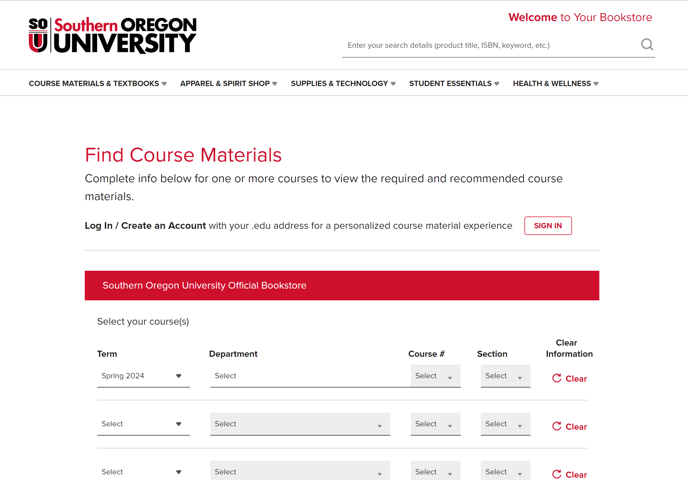

# Southern Oregon University Textbook Scraper

## Disclaimer
This is a work in progress and not finished. I have been granted permission to scrape this data for Southern Oregon University. I do not condone scalping unless granted permission from the organization, company, or individual(s). 

## Description
TextbookScalper is a project aimed at gathering and organizing textbook information from the Southern Oregon University bookstore website, which is managed by Barnes and Noble. The goal is to provide a comprehensive and easily accessible database of textbook data, including details such as term, department, course, section, professor, textbook title, authors, edition, publisher, ISBN, and various pricing options.

## Status

### Postponed until furthur notice

## Features
* Scrapes textbook data from the Southern Oregon University bookstore website
* Organizes data into a structured format
* Outputs data to a CSV file for easy viewing and analysis

## Installation
1. Clone the repository
2. Run `npm install` to install dependencies
3. Run the command `mkdir csv_files` to make the folder
4. Run command `touch csv_files/souTextbooksList.csv` to make the file in csv_files
5. Run this command to insert the headers inside the csv file `echo "term,department,course,section,professor,textbook,authors,edition,publisher,isbn,newPrintPrice,usedPrintPrice,newRentalPrintPrice,usedRentalPrintPrice,rentOnlyPrice,digitalPurchasePrice,digitalRentalPrice,oer" >> csv_files/souTextbooksList.csv`
6. Run `node main.js` to start the program

## Usage
After running `node main.js`, the program will begin scraping data from the bookstore website and outputting it to a CSV file.

## Troubleshooting
Sometimes running puppeteer requires a set of packages if you're running it on a Linux subsystem. Run this command to download all of the necessary packages:

`sudo apt install ca-certificates fonts-liberation libappindicator3-1 libasound2 libatk-bridge2.0-0 libatk1.0-0 libc6 libcairo2 libcups2 libdbus-1-3 libexpat1 libfontconfig1 libgbm1 libgcc1 libglib2.0-0 libgtk-3-0 libnspr4 libnss3 libpango-1.0-0 libpangocairo-1.0-0 libstdc++6 libx11-6 libx11-xcb1 libxcb1 libxcomposite1 libxcursor1 libxdamage1 libxext6 libxfixes3 libxi6 libxrandr2 libxrender1 libxss1 libxtst6 lsb-release wget xdg-utils`

If you recieve a Node error because of an unclickable element, this is a common issue with the website and how it renders its elements. With the speed of Puppeteer it's also likely it misses a selector as well. To work around this, I would recommend just restarting the scraper to recieve a new instance of the website.

## Tech Stack
* Puppeteer
* *Electron (not currently implemented)*

## Notes
* When a textbook is available on the second page, they are identified with a unique string. For example: ``courseGroup_8112_8112_1_24_S_230_314_1``

Usage within the code to specify the textbook:

    ``var specificTextbookSelector = '#courseGroup_8112_8112_1_' + year + '_230_' + course + '_' + courseAmount;``

*  For the OER designations, ZCST typically means *No Course Materials Required* and if *Course Materials Selection Pending*, then we give no designation. The Low Cost Designation (LCST) ranges from a total textbook cost of 49.99 or lower. For more information, refer to the oerCourseDesignations.js file.

* Terms automatically change on the website on specific days, but those days are not outlined or explained outright.

* There are a total of 54 departments at SOU

* Courses with an L (like 301L) refer to the lab section of the class, which are likely to have a textbook rather than their int counterpart (301).

* Courses may have multiple sections, which aren't like to all have different textbooks, but it's not clear which section has the textbook. For example, if a course has three sections for different timeslots for the same course, it's likely only one section has the recommended or required textbook.

* The sou.bcollege.com website is not entirely stable and will have anomalies with how fast selectors render and what is able to be clicked. This is a combination of the stability of the server running the website and the speed of Puppeteer. To counter this, I slowed down the scraper to ensure that the majority of the time the bot is able to grab all the information.

* Both the user and the bot are unable to access the second page as a link because the link is dynamically generated with the user and the information the user selects on the first page. This requires the bot and user to always enter in the info on the first page to be able to navigate to the second. This can make debugging lengthy

* Selectors on the page rarely change, but if they do, it's important to update them for the scraper. The rest of the information should be dynamic enough to continue working.

## Contributing
Contributes are currently put on hold as the project develops. Once the full release is provided, contributions will be open and welcome.

## Authors and Acknowledgment
Developed by Sergio Mendoza

## Contact
For information, feel free to contact me at ``mendozas1@sou.edu`` or feel free to make an issue if you're experiencing issues and I will get to it as soon as possible.

## Screenshots/Demo

## Future Plans
- Notes will go here on needed changes
- Move file out of main